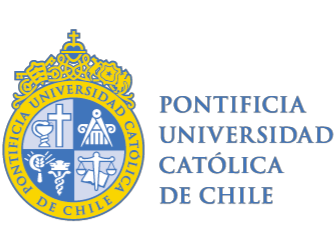

::: {.Docencia}
## Cursos Pontificia Universidad Católica de Chile

### Postgrado

::: columns
::: {.column width="25%"}
{width=80 alt="Curso puc"}
:::
::: {.column width="75%"}

Análisis de Modelos de Ecuaciones Estructurales.

  - Curso optativo
  - Instituto de Sociología
  - Facultad de Ciencias Sociales
  - Pontificia Universidad Católica de Chile
  - 16 alumnos
  - Primer semestre de 2024
  - 2 horas de docencia directa semanal
  - 5 horas de asignatura semanal
  - Responsable único
:::

::: {.column width="25%"}
{width=80 alt="Curso puc"}
:::
::: {.column width="75%"}

Análisis de Modelos de Ecuaciones Estructurales.

  - Curso optativo
  - Instituto de Sociología
  - Facultad de Ciencias Sociales
  - Pontificia Universidad Católica de Chile
  - 16 alumnos
  - Primer semestre de 2023
  - 2 horas de docencia directa semanal
  - 5 horas de asignatura semanal
  - Responsable único
:::

::: {.column width="25%"}
{width=80 alt="Curso puc"}
:::
::: {.column width="75%"}

Análisis de Modelos de Ecuaciones Estructurales.

  - Curso optativo
  - Instituto de Sociología
  - Facultad de Ciencias Sociales
  - Pontificia Universidad Católica de Chile
  - 15 alumnos
  - Segundo semestre de 2020
  - 2 horas de docencia directa semanal
  - 5 horas de asignatura semanal
  - Responsable único
:::

::: {.column width="25%"}
{width=80 alt="Curso puc"}
:::
::: {.column width="75%"}

Análisis de Datos Categóricos.

  - Curso obligatorio
  - Instituto de Sociología
  - Facultad de Ciencias Sociales
  - Pontificia Universidad Católica de Chile
  - 29 alumnos
  - Segundo semestre de 2019
  - 2 horas de docencia directa semanal
  - 10 horas de asignatura semanal
  - Responsable único
:::
::: {.column width="25%"}
{width=80 alt="Curso puc"}
:::
::: {.column width="75%"}

Análisis de Modelos de Ecuaciones Estructurales.

  - Curso optativo
  - Instituto de Sociología
  - Facultad de Ciencias Sociales
  - Pontificia Universidad Católica de Chile
  - 20 alumnos
  - Primer semestre de 2019
  - 2 horas de docencia directa semanal
  - 5 horas de asignatura semanal
  - Responsable único
:::
::: {.column width="25%"}
{width=80 alt="Curso puc"}
:::
::: {.column width="75%"}

Metodología Cuantitativa Avanzada I

  - Curso obligatorio
  - Instituto de Sociología
  - Facultad de Ciencias Sociales
  - Pontificia Universidad Católica de Chile
  - 15 alumnos
  - Primer semestre de 2016
  - 2 horas de docencia directa semanal
  - 10 horas de asignatura semanal
  - Instructor
:::

:::

### Pregrado 

::: columns
::: {.column width="25%"}
{width=80 alt="Curso puc"}
:::
::: {.column width="75%"}

Métodos de investigación cuantitativa.

  - Curso obligatorio
  - Escuela de Psicología
  - Facultad de Ciencias Sociales
  - Pontificia Universidad Católica de Chile
  - 42 alumnos
  - Primer semestre de 2024
  - 2 horas de docencia directa semanal
  - 10 horas de asignatura semanal
  - Responsable único
:::

::: {.column width="25%"}
{width=80 alt="Curso puc"}
:::
::: {.column width="75%"}

Métodos de investigación cuantitativa.

  - Curso obligatorio
  - Escuela de Psicología
  - Facultad de Ciencias Sociales
  - Pontificia Universidad Católica de Chile
  - 43 alumnos
  - Primer semestre de 2023
  - 2 horas de docencia directa semanal
  - 10 horas de asignatura semanal
  - Responsable único
:::

::: {.column width="25%"}
{width=80 alt="Curso puc"}
:::
::: {.column width="75%"}

Psicología Social

  - Curso obligatorio
  - Escuela de Psicología
  - Facultad de Ciencias Sociales
  - Pontificia Universidad Católica de Chile
  - 74 alumnos
  - Primer semestre de 2023
  - 2 horas de docencia directa semanal
  - 10 horas de asignatura semanal
  - Responsable único
:::

::: {.column width="25%"}
{width=80 alt="Curso puc"}
:::
::: {.column width="75%"}

Métodos de investigación cuantitativa.

  - Curso obligatorio
  - Escuela de Psicología
  - Facultad de Ciencias Sociales
  - Pontificia Universidad Católica de Chile
  - 44 alumnos
  - Primer semestre de 2022
  - 2 horas de docencia directa semanal
  - 10 horas de asignatura semanal
  - Responsable único
:::
::: {.column width="25%"}
{width=80 alt="Curso puc"}
:::
::: {.column width="75%"}

Metodologías de investigación en Psicología.

  - Curso obligatorio
  - Escuela de Psicología
  - Facultad de Ciencias Sociales
  - Pontificia Universidad Católica de Chile
  - 39 alumnos
  - Segundo semestre de 2022
  - 2 horas de docencia directa semanal
  - 10 horas de asignatura semanal
  - Responsable único
:::
::: {.column width="25%"}
{width=80 alt="Curso puc"}
:::
::: {.column width="75%"}

Métodos de investigación cuantitativa.

  - Curso obligatorio
  - Escuela de Psicología
  - Facultad de Ciencias Sociales
  - Pontificia Universidad Católica de Chile
  - 43 alumnos
  - Primer semestre de 2021
  - 2 horas de docencia directa semanal
  - 10 horas de asignatura semanal
  - Responsable único
:::

::: {.column width="25%"}
{width=80 alt="Curso puc"}
:::
::: {.column width="75%"}

Metodologías de investigación en Psicología.

  - Curso obligatorio
  - Escuela de Psicología
  - Facultad de Ciencias Sociales
  - Pontificia Universidad Católica de Chile
  - 35 alumnos
  - Segundo semestre de 2021
  - 2 horas de docencia directa semanal
  - 10 horas de asignatura semanal
  - Responsable único
:::

::: {.column width="25%"}
{width=80 alt="Curso puc"}
:::
::: {.column width="75%"}

Métodos de investigación cuantitativa.

  - Curso obligatorio
  - Escuela de Psicología
  - Facultad de Ciencias Sociales
  - Pontificia Universidad Católica de Chile
  - 44 alumnos
  - Primer semestre de 2020
  - 2 horas de docencia directa semanal
  - 10 horas de asignatura semanal
  - Responsable único
:::

::: {.column width="25%"}
{width=80 alt="Curso puc"}
:::
::: {.column width="75%"}

Metodologías de investigación en Psicología.

  - Curso obligatorio
  - Escuela de Psicología
  - Facultad de Ciencias Sociales
  - Pontificia Universidad Católica de Chile
  - 36 alumnos
  - Primer semestre de 2020
  - 2 horas de docencia directa semanal
  - 10 horas de asignatura semanal
  - Responsable único
:::

::: {.column width="25%"}
{width=80 alt="Curso puc"}
:::
::: {.column width="75%"}

Individuo y Sociedad

  - Curso obligatorio
  - Instituto de Sociología
  - Facultad de Ciencias Sociales
  - Pontificia Universidad Católica de Chile
  - 69 alumnos
  - Segundo semestre de 2018
  - 2 horas de docencia directa semanal
  - 10 horas de asignatura semanal
  - Responsable único
:::

::: {.column width="25%"}
{width=80 alt="Curso puc"}
:::
::: {.column width="75%"}

Metodologías de Investigación Social

  - Curso obligatorio
  - Instituto de Sociología
  - Facultad de Ciencias Sociales
  - Pontificia Universidad Católica de Chile
  - 36 alumnos
  - Segundo semestre de 2017
  - 2 horas de docencia directa semanal
  - 10 horas de asignatura semanal
  - Responsable único
:::

::: {.column width="25%"}
{width=80 alt="Curso puc"}
:::
::: {.column width="75%"}

Metodologías de Investigación Social

  - Curso obligatorio
  - Instituto de Sociología
  - Facultad de Ciencias Sociales
  - Pontificia Universidad Católica de Chile
  - 28 alumnos
  - Segundo semestre de 2016
  - 2 horas de docencia directa semanal
  - 10 horas de asignatura semanal
  - Responsable único
:::

:::
:::