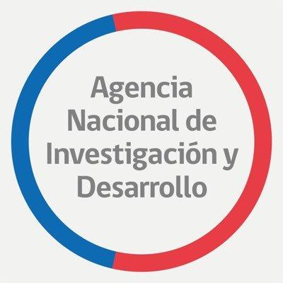
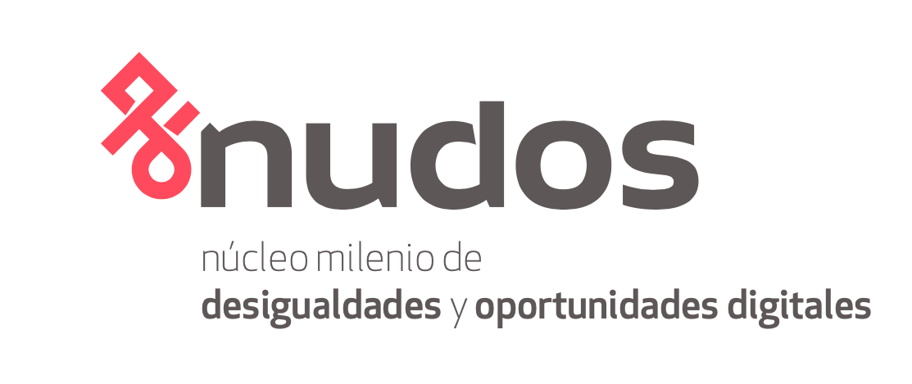
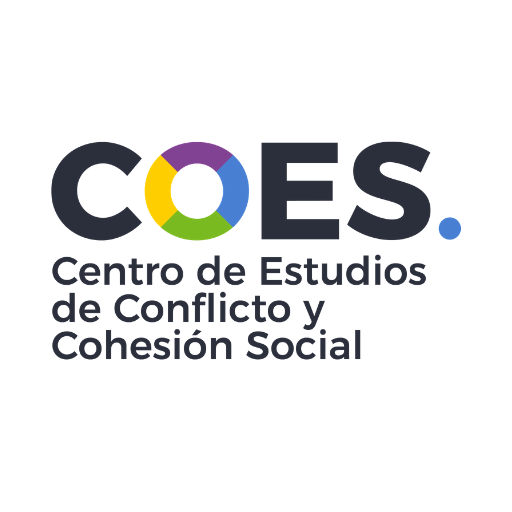
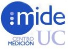
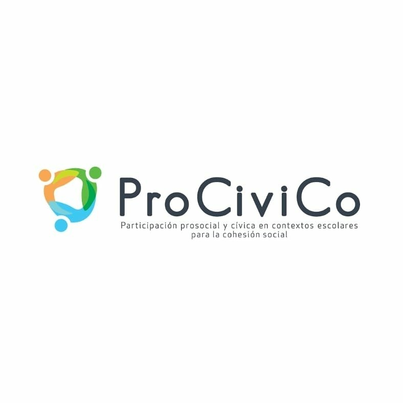

::: {.Proyectos}

## En curso

::: columns
::: {.column width="25%"}
{width=100 alt="fondecyt"}
:::
::: {.column width="75%"}

**Proyecto FONDECYT regular N° 1240922: Actitudes y comportamiento político juvenil: desigualdad, estilos de socialización escolar e influencias intergeneracionales.**

  - Abril 2024 - Marzo 2028
  - Investigador Responsable
:::
:::

::: columns
::: {.column width="25%"}
{width=100 alt="fondecyt"}
:::
::: {.column width="75%"}

**Proyecto FONDECYT regular N° 1240960: Aprendizaje político en movimiento sociales: ¿portadores individuales, organizacionales y generacionales?**

  - Abril 2024 - Marzo 2028
  - Co-investigador
:::
:::

::: columns
::: {.column width="25%"}
{width=100 alt="COES"}
:::
::: {.column width="75%"}

**Núcleo Milenio sobre Oportunidades y Desigualdades Digitales (NUDOS)**

  - Enero 2023 - Presente
  - Investigador adjunto
:::
:::

## Proyectos anteriores

::: columns
::: {.column width="25%"}
{width=100 alt="COES"}
:::
::: {.column width="75%"}

**Centro de Estudios de Conflicto y Cohesión Social (COES)**

  - Enero 2023 - Noviembre 2025
  - Investigador asociado
  - Línea de interacciones grupales e individuales
:::
:::

::: columns
::: {.column width="25%"}
{width=100 alt="Curso puc"}
:::
::: {.column width="75%"}

**MIDE UC**

  - Marzo 2018 - Mayo 2024
  - Profesor Investigador Asistente
  - Escuela de Psicología
  - Pontificia Universidad Católica de Chile
:::
:::

::: columns
::: {.column width="25%"}
{width=100 alt="IEA"}
:::
::: {.column width="75%"}

**Proyecto Environmental Knowledge and Environmental Attitudes among Secondary School Student**

  - Diciembre 2022 - Septiembre 2024
  - Co-investigador
  - Investigador responsable: Profesor Andrés Sandoval-Hernández, Department of Education, University of Bath, UK
  - Financiado por International Association for the Evaluation of Educational Achievement (IEA)
:::
:::

::: columns
::: {.column width="25%"}
{width=100 alt="procivico"}
:::
::: {.column width="75%"}

**Proyecto Procesos de socialización de la cohesión social intergrupal en NNA: Hacia el escalamiento y la medición a nivel municipal del programa ProCiviCo (Participación Prosocial y Ciudadana para la cohesión social)**

  - Enero 2023 - Abril 2024
  - Co-investigador
  - Investigadora Responsable: Profesora Paula Luengo-Kanacri, Escuela de Psicología, Pontificia Universidad Católica de Chile.
  - Financiado por el Centro de Estudios de Conflicto y Cohesión Social (COES).
:::
:::

::: columns
::: {.column width="25%"}
{width=100 alt="fondecyt"}
:::
::: {.column width="75%"}

**Proyecto FONDECYT iniciación N° 11190508: Participación Ciudadana Juvenil: entre la reproducción social y la socialización política**

  - noviembre 2019 - octubre 2022
  - Investigador responsable
:::
:::

::: columns
::: {.column width="25%"}
{width=100 alt="IEA"}
:::
::: {.column width="75%"}

**Proyecto Good Citizenship Around the World**

  - 2019 - 2020
  - Co-investigador
  - Investigador responsable: Profesor Ernesto Treviño, Facultad de Educación, Pontificia Universidad Católica de Chile
  - Financiado por International Association for the Evaluation of Educational Achievement (IEA)
:::
:::

::: columns
::: {.column width="25%"}
{width=100 alt="fondecyt"}
:::
::: {.column width="75%"}

**Proyecto FONDECYT regular N° 1181239:  Socialización política y educación para la ciudadanía: el rol de la familia y la escuela.**

  - Marzo 2018 - Marzo 2021
  - Co-investigador
  - Investigador responsable: Profesor Cristián Cox Donoso, Facultad de Educación, Universidad Diego Portales
:::
:::

::: columns
::: {.column width="25%"}
{width=100 alt="COES"}
:::
::: {.column width="75%"}

**Centro de Estudios de Conflicto y Cohesión Social (COES)**

  - Marzo 2018 - Septiembre 2021
  - Investigador adjunto
  - Línea de interacciones grupales e individuales
:::
:::

::: columns
::: {.column width="25%"}
{width=100 alt="fondecyt"}
:::
::: {.column width="75%"}

**Proyecto FONDECYT regular N° 1120630:  Socialización política y experiencia escolar: Chile en contexto internacional**

  - Marzo 2012 - Marzo 2015
  - Co-investigador
  - Investigador responsable: Profesor Cristián Cox Donoso, Facultad de Educación, Universidad Diego Portales
:::
:::

:::